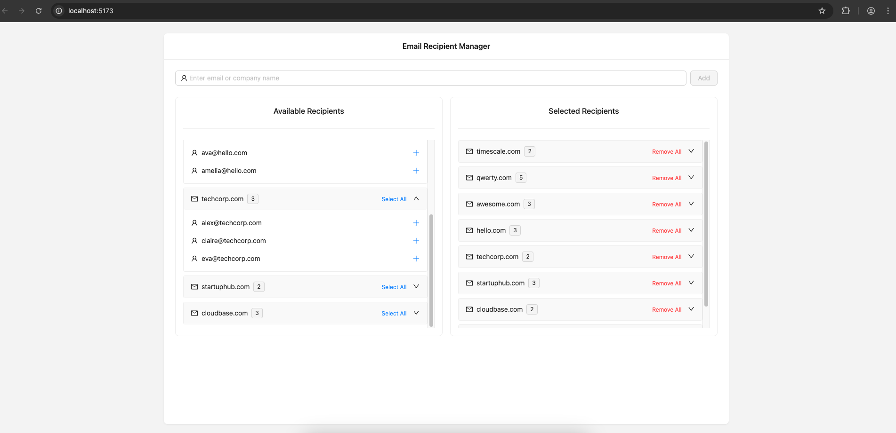

# Email Recipients Manager

## 📋 Overview
A Vue.js component that allows managing email addresses through an intuitive interface. This component displays and manages two lists: available recipients and selected recipients, with powerful selection, grouping, and filtering capabilities.

## ✨ Features
- View available recipients as individual emails or grouped by company domain
- Select individual recipients or entire company domains at once
- Search recipients by company name with autocomplete suggestions
- Add new email addresses with validation
- Group selected recipients by company with expandable/collapsible sections
- Remove individual or domain-grouped recipients

## 🔍 Preview


## 🚀 Tech Stack
- Vue.js
- Ant Design UI
- Vitest for testing

## 📊 Test Coverage
- **85.79%** Statements (453/528)
- **95.34%** Branches (82/86)
- **86.66%** Functions (26/30)
- **85.79%** Lines (453/528)

## 🛠️ Installation

```bash
# Clone the repository
git clone https://github.com/tejaschokhawala/email-manager.git

# Navigate to project directory
cd email-manager

# Install dependencies
pnpm install

# Start development server
pnpm run dev
```

### Props

| Name | Type | Default | Description |
|------|------|---------|-------------|
| `initialRecipients` | Array | `[]` | Initial list of recipient objects with `email` and `isSelected` properties |
| `placeholder` | String | `'Search or add email...'` | Placeholder text for the input field |
| `maxHeight` | Number | `300` | Maximum height in pixels for the recipient lists |

### Events

| Name | Payload | Description |
|------|---------|-------------|
| `update:selected` | Array | Emitted when selection changes with an array of selected recipients |
| `add:recipient` | Object | Emitted when a new recipient is added |
| `remove:recipient` | Object | Emitted when a recipient is removed |

## 🧪 Running Tests

```bash
# Run all tests
npm run test

# Run tests with coverage
npm run test:coverage
```

## 📝 Assignment Requirements Checklist
- [x] Display available recipients list
- [x] Group recipients by company domain
- [x] Select individual or domain-grouped recipients
- [x] Search by company name with autocomplete
- [x] Add validated email addresses
- [x] Group and expand/collapse selected recipients
- [x] Remove individual or grouped recipients
- [x] Clean, responsive design
- [x] Cross-browser compatibility
- [x] Unit tests

## 📄 License
MIT